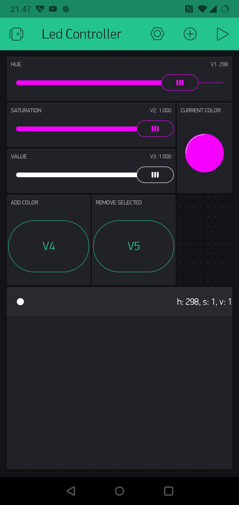
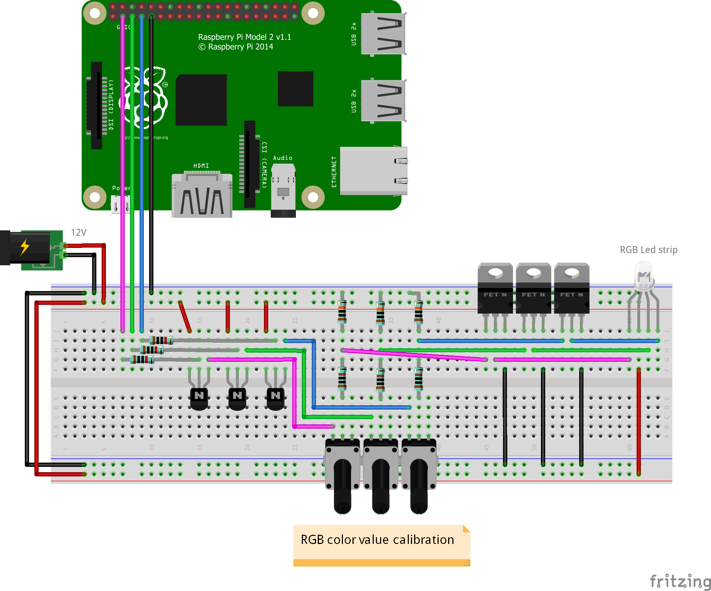

# Led controller

A RGB led strip controller program for Raspberry Pi. Uses Blynk app as controller UI.


## Installation

First you need Node.js and npm package manager.

To install the program just run `npm install`, while in the root directory of this program. You also need to copy/rename the _config_example.js_ to _config.js_ and insert your own Blynk authorization key in the file.

Here is an example UI layout in the Blynk app:



The table component is bound to V0 and the "Current color" led to V6. The hue slider has value range from 0 to 360 and the saturation and value sliders have range from 0 to 1. The table component supports row selection and changing the order of the rows.

Here is example schematics for the led strip controller:




## Running the script
The script should be run as root, because the GPIO libraries need root privileges.
```
sudo node ./ledController.js
```

Run the program like this, if the dependencies are already installed globally:
```
sudo NODE_PATH=/usr/local/lib/node_modules node ./ledController.js
```


## Dependencies

* [blynk-library](https://github.com/vshymanskyy/blynk-library-js) - Blynk
* [raspi](https://github.com/nebrius/raspi) - Raspberry Pi GPIO
* [raspi-soft-pwm](https://github.com/nebrius/raspi-soft-pwm) - Software PWM for Raspberry Pi GPIO
* [tiny-worker](https://github.com/avoidwork/tiny-worker) - Node processes with WebWorker API
